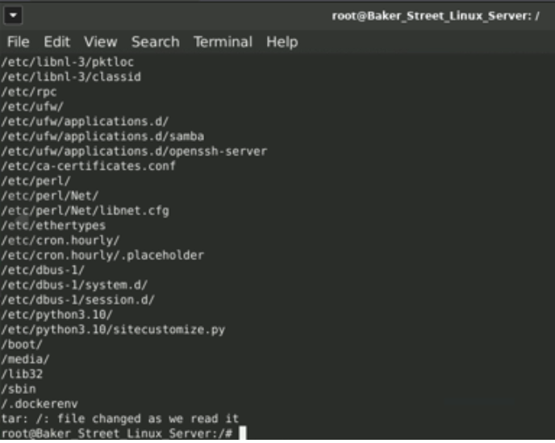
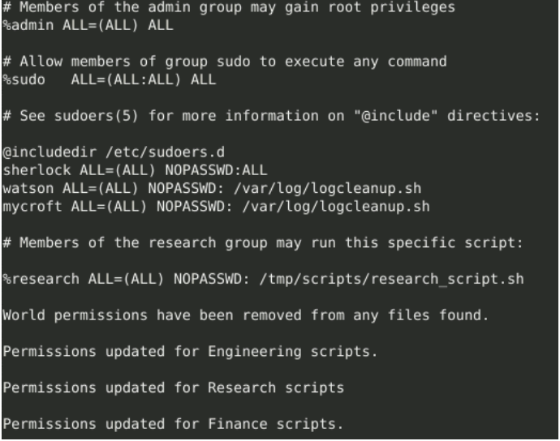

# Linux Server Hardening  

## Objective  
The Linux Server Hardening project aimed to strengthen the security posture of Baker Street Corporation’s production Linux server by identifying vulnerabilities and applying industry best practices for system hardening. The primary focus was to audit user and group accounts, enforce strict password and sudo policies, secure SSH access, remove insecure services, patch system software, and configure logging for long-term monitoring. This hands-on engagement was designed to minimize attack surfaces, ensure least-privilege access, and develop practical skills in server administration, security configuration, and automated compliance maintenance.  

### Skills Learned  
- Auditing and managing Linux users, groups, and permissions  
- Configuring strong password and sudo policies with PAM and visudo  
- Securing SSH access to prevent unauthorized logins  
- Removing insecure services and patching system vulnerabilities  
- Automating server hardening tasks with Bash scripts and cron jobs  

### Tools Used  
- **Pluggable Authentication Module (PAM):** For enforcing strong password complexity and aging policies.  
- **Privilege Management Tools (visudo, sudo):** For applying least-privilege access controls.  
- **Firewall and Auditing Utilities (UFW, Lynis, Tripwire):** For system hardening, vulnerability detection, and file integrity monitoring.  
- **Package Management System (apt):** For patching vulnerabilities and installing security updates.  
- **Automation Tools (Bash scripting, cron):** For scheduling recurring hardening tasks and compliance checks.  

## Steps
**Step 1 — System Backup**  
Created a complete backup of the Linux server, excluding volatile directories, to ensure recovery capability in case of failure or misconfiguration.  
*Ref 1: Backup Command Execution*

**Step 2 — User & Group Audit**  
Removed terminated user accounts, locked inactive accounts, and reorganized employees into the correct groups to align with updated security policies.  
*Ref 2: User Management Output*

**Step 3 — Password Policy Enforcement**  
Configured PAM to require strong passwords with minimum length and character complexity requirements, reducing the risk of weak credentials.  
*Ref 3: Password Policy Configuration*

**Step 4 — Sudo Permission Management**  
Set granular sudo privileges, granting full access to select administrators while limiting others to specific scripts.  
*Ref 4: Sudoers File Snippet*

**Step 5 — SSH Hardening**  
Edited `/etc/ssh/sshd_config` to disable root login and empty passwords, enforced SSH Protocol 2, and restarted the SSH service.  
*Ref 5: SSH Configuration File Edits*

**Step 6 — Package Review & Update**  
Updated all installed packages, removed insecure services (`telnet`, `rsh-client`), and installed security tools (`ufw`, `lynis`, `tripwire`).  
*Ref 6: Package Update Output*

**Step 7 — Disabling Unnecessary Services**  
Identified unused services such as `mysql` and `samba`, stopped them, disabled them from startup, and removed them to reduce the attack surface.  
*Ref 7: Service Management Output*

**Step 8 — Logging Configuration**  
Configured persistent logging via `journald.conf` and set up daily log rotation with 7-day retention to maintain visibility without consuming excessive storage.  
*Ref 8: Logging Settings*

**Step 9 — Automation with Scripts**  
Created `hardening_script1.sh` (monthly) and `hardening_script2.sh` (weekly) to automate recurring security checks and configurations.  

*Ref 9: Script Contents*

**Step 10 — Scheduling with Cron**  
Scheduled both hardening scripts to run automatically using cron, ensuring regular system maintenance without manual intervention.  
*Ref 10: Cron Schedule Setup*

